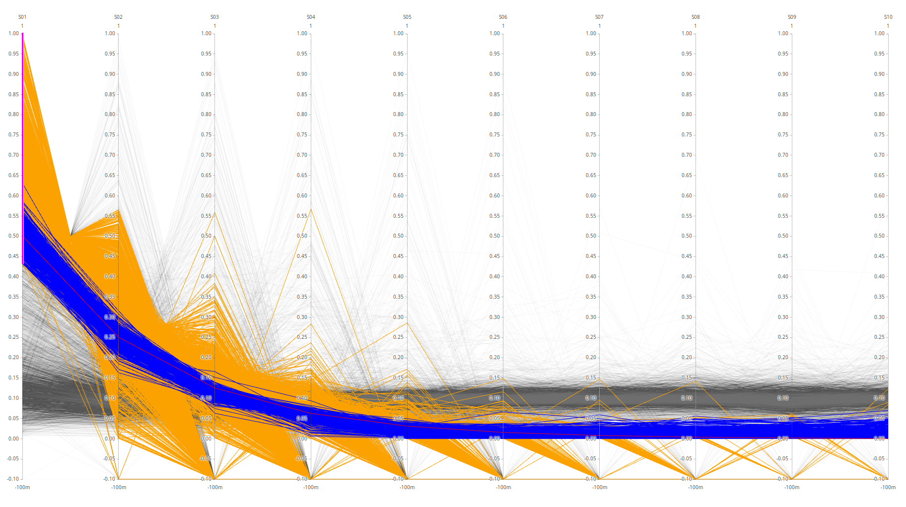
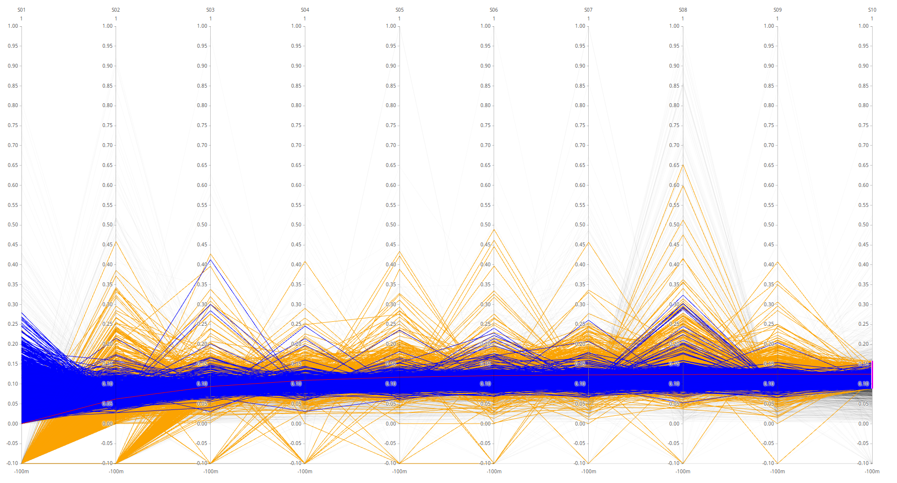
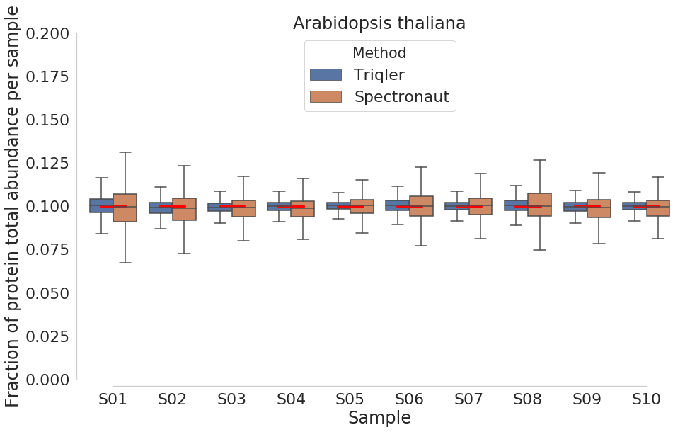

# bayesProtQuant

# Table of Contents
1. [Introduction](#introduction)
2. [Project Description](#project-description)
3. [Tools](#tools)
4. [Project Log](#project-log)
5. [Contact](#contact)

## Introduction


[About]()
[Members]()
[Project Log]()

Also here is a link to a page [page2](page2)
## Project description
## Tools

## Project Log
### 2020-07-02 Volcano plot S02 vs S06 with correct FC range.
Parameters
Treshold on protein id.
PG.Qvalue < 0.01
Q-value based on protein_id_posterior_error_prob expanding mean < 0.01

We investigate amount of differential expression in the vicinity of true FC. The interval range was based on trueFC/2 for CAEEL and HUMAN. For ARATH no FC interval was used, since all registered diffExp are false.

Differentially expressed proteins

|METHOD | ARATH | CAEEL | HUMAN |
|----------------------|------------------|--------------------------| 
| Triqler       |     3     | 615             | 5128                     |  
| Spectronaut       |    37      | 162             | 3785                     |  


[q-value Overlay ARATH FC = 0.0 ](pages/2019-07-02_volcanoFC/volcano_overlay_ARATH_S02_S06.html)

[q-value Overlay CAEEL FC = -6 < FC < -2 ](pages/2019-07-02_volcanoFC/volcano_overlay_CAEEL_S02_S06.html)

[q-value Overlay HUMAN FC = 0.475 < FC < 1.425](pages/2019-07-02_volcanoFC/volcano_overlay_HUMAN_S02_S06.html)

### 2020-07-02 Parallell coordinates, highlights.
Parameters:
Treshold
PG.Qvalue < 0.01
Q-value based on protein_id_posterior_error_prob expanding mean < 0.01
Samples are averaged to concatenate runs.
Normalization on proteins (row-wise) resulting in fractions. 
Orange line - Spectronaut.
Blue line - triqler.
red line - true fractions.
NOTE: -0.1 values in parallell coordinates are NaN:s converted to -0.1.
CAEEL.


HUMAN - triqler on top.


HUMAN - spectronaut on top.


### 2020-07-01 Thoughts on volcano plots, parallell coordinates and data processeing.

#### Notes on data processing for volcano plot and parallell coordinates on previous posts...
The FDR used was on protein identification FDR. For spectronaut PG.Qvalue < 0.01 was used and for triqler protein_id_posterior_error_prob converted to q-value < 0.01 was used. 

```python
...
triqler.sort_values(by = "protein_id_posterior_error_prob", inplace = True)
triqler["FDR"] = triqler["protein_id_posterior_error_prob"].expanding().mean()
triqler = triqler[triqler["FDR"] < 0.01]
...
```


protein_id_posterior_error_prob is calculated from "searchScore" in triqler input (which is the PG.Cscore). The PG.Cscore are converted to PEP-values and these PEP-values are then logarthimed and summed for target and decoy proteins. 

#### Parallell coordinates notes...
The data is normalized protein-wise (row-wise). High spectronaut values (>0.8) are caused by normalization where one value is much bigger than the others or when there are lots of NaNs in the protein-row. Triqler has no NaNs and the plot therefore becomes a lot more "well-behaved". 

This could possibly be fixed by assuming proteins with a lot of NaNs are not clearly identified and should thus be omitted, and in the case of very large outlying proteins, either omit the protein or omit the outlier values. 

#### volcano plot...
The triqler points are computed by t-testing the means from the posterior distributions for each protein. This does not fully utilize triqlers FC q-value computation abilities. 

On the side note, these means from the posterior distributions seems to consistently perform in a more correct manner than spectronaut results. They are more centered around correct FC and have a better TP/(TP+FN) ratio.


### 2020-07-01 Volcano Plot S02 vs S06 and true FC.
The true log2FC S02 vs S06

| ARATH | CAEEL | HUMAN |
|----------------------|------------------|--------------------------| 
| 0.0                 | -4.011587974275212             | 0.9545685707529938                     |  

#### p-value volcano FC = 0.8
[p-value Overlay ARATH FC = 0.8 ](pages/2019-06-30_volcanoPlot/p/volcano_overlay_ARATH_S02_S06.html)

[p-value Overlay CAEEL FC = 0.8](pages/2019-06-30_volcanoPlot/p/volcano_overlay_CAEEL_S02_S06.html)

[p-value Overlay HUMAN FC = 0.8](pages/2019-06-30_volcanoPlot/p/volcano_overlay_HUMAN_S02_S06.html)


[p-value Spectronaut ARATH FC = 0.8](pages/2019-06-30_volcanoPlot/p/volcano_spectronaut_ARATH_S02_S06.html)

[p-value Spectronaut CAEEL FC = 0.8](pages/2019-06-30_volcanoPlot/p/volcano_spectronaut_CAEEL_S02_S06.html)

[p-value Spectronaut HUMAN FC = 0.8](pages/2019-06-30_volcanoPlot/p/volcano_spectronaut_HUMAN_S02_S06.html)


[p-value Triqler ARATH FC = 0.8](pages/2019-06-30_volcanoPlot/p/volcano_triqler_ARATH_S02_S06.html)

[p-value Triqler CAEEL FC = 0.8](pages/2019-06-30_volcanoPlot/p/volcano_triqler_CAEEL_S02_S06.html)

[p-value Triqler HUMAN FC = 0.8](pages/2019-06-30_volcanoPlot/p/volcano_triqler_HUMAN_S02_S06.html)


#### p-value volcano FC = True FC 
[p-value Overlay ARATH FC = True FC](pages/2019-06-30_volcanoPlot/pTrue/volcano_overlay_ARATH_S02_S06.html)

[p-value Overlay CAEEL FC = True FC](pages/2019-06-30_volcanoPlot/pTrue/volcano_overlay_CAEEL_S02_S06.html)

[p-value Overlay HUMAN FC = True FC](pages/2019-06-30_volcanoPlot/pTrue/volcano_overlay_HUMAN_S02_S06.html)


[p-value Spectronaut ARATH FC = True FC](pages/2019-06-30_volcanoPlot/pTrue/volcano_spectronaut_ARATH_S02_S06.html)

[p-value Spectronaut CAEEL FC = True FC](pages/2019-06-30_volcanoPlot/pTrue/volcano_spectronaut_CAEEL_S02_S06.html)

[p-value Spectronaut HUMAN FC = True FC](pages/2019-06-30_volcanoPlot/pTrue/volcano_spectronaut_HUMAN_S02_S06.html)


[p-value Triqler ARATH FC = True FC](pages/2019-06-30_volcanoPlot/pTrue/volcano_triqler_ARATH_S02_S06.html)

[p-value Triqler CAEEL FC = True FC](pages/2019-06-30_volcanoPlot/pTrue/volcano_triqler_CAEEL_S02_S06.html)

[p-value Triqler HUMAN FC = True FC](pages/2019-06-30_volcanoPlot/pTrue/volcano_triqler_HUMAN_S02_S06.html)

#### q-value volcano FC = 0.8
[q-value Overlay ARATH FC = 0.8](pages/2019-06-30_volcanoPlot/q/volcano_overlay_ARATH_S02_S06.html)

[q-value Overlay CAEEL FC = 0.8](pages/2019-06-30_volcanoPlot/q/volcano_overlay_CAEEL_S02_S06.html)

[q-value Overlay HUMAN FC = 0.8](pages/2019-06-30_volcanoPlot/q/volcano_overlay_HUMAN_S02_S06.html)


[q-value Spectronaut ARATH FC = 0.8](pages/2019-06-30_volcanoPlot/q/volcano_spectronaut_ARATH_S02_S06.html)

[q-value Spectronaut CAEEL FC = 0.8](pages/2019-06-30_volcanoPlot/q/volcano_spectronaut_CAEEL_S02_S06.html)

[q-value Spectronaut HUMAN FC = 0.8](pages/2019-06-30_volcanoPlot/q/volcano_spectronaut_HUMAN_S02_S06.html)


[q-value Triqler ARATH FC = 0.8](pages/2019-06-30_volcanoPlot/q/volcano_triqler_ARATH_S02_S06.html)

[q-value Triqler CAEEL FC = 0.8](pages/2019-06-30_volcanoPlot/q/volcano_triqler_CAEEL_S02_S06.html)

[q-value Triqler HUMAN FC = 0.8](pages/2019-06-30_volcanoPlot/q/volcano_triqler_HUMAN_S02_S06.html)

#### q-value volcano FC = True FC
[q-value Overlay ARATH FC = True FC](pages/2019-06-30_volcanoPlot/qTrue/volcano_overlay_ARATH_S02_S06.html)

[q-value Overlay CAEEL FC = True FC](pages/2019-06-30_volcanoPlot/qTrue/volcano_overlay_CAEEL_S02_S06.html)

[q-value Overlay HUMAN FC = True FC](pages/2019-06-30_volcanoPlot/qTrue/volcano_overlay_HUMAN_S02_S06.html)


[q-value Spectronaut ARATH FC = True FC](pages/2019-06-30_volcanoPlot/qTrue/volcano_spectronaut_ARATH_S02_S06.html)

[q-value Spectronaut CAEEL FC = True FC](pages/2019-06-30_volcanoPlot/qTrue/volcano_spectronaut_CAEEL_S02_S06.html)

[q-value Spectronaut HUMAN FC = True FC](pages/2019-06-30_volcanoPlot/qTrue/volcano_spectronaut_HUMAN_S02_S06.html)


[q-value Triqler ARATH FC = True FC](pages/2019-06-30_volcanoPlot/qTrue/volcano_triqler_ARATH_S02_S06.html)

[q-value Triqler CAEEL FC = True FC](pages/2019-06-30_volcanoPlot/qTrue/volcano_triqler_CAEEL_S02_S06.html)

[q-value Triqler HUMAN FC = True FC](pages/2019-06-30_volcanoPlot/qTrue/volcano_triqler_HUMAN_S02_S06.html)


Note the issue with pi0 = estimated or 1...


### 2020-06-30 Comparison plot for adjusted intensity and parallell plot for non-adjusted intensity.

#### full set


#### S02-S08


#### S03-S08


#### Parallell coordinates of non-adjusted intensity
Will do this on adjusted data set later...

[A. Thaliana parallell coordinates](pages/at_t.html)

[C. Elegans parallell coordinates](pages/ce.html)

[H. Sapiens parallell coordinates](pages/hs.html)


NOTE TO SELF: still need to fix label issue for parallell coordinates.

### 2020-06-27 fixing the 1.0 intensity error in PSSS3 data set for triqler.

[Here is a link to a short analysis of the 1.0 intensities](pages/check_1_intensity.md)

ToDo: if not "decoy" suffix in triqlerFormatted data: if intensity == 0 => Drop by setting the intensities to 0.0.

### 2020-06-26 loglog plot of p-values vs q-values of triqler results of human S02 v S06


Converting p-values to q-values should usually lower the amount of significant proteins. Looking at the q-value conversion with pi0 estimates, we can see that at high p- and q-values, there are actually more significant proteins for p-values. The histogram shows that this is because the pi0 estimate is set very low (pi0 = 0.0724). Fixing the pi0 = 1 gives the expected behaviour of less significant proteins at q-value significance.

Higher pi0 gives higher q-values and are thus more conservatives and should give less significance.

These experiment can be generated using code in https://github.com/patruong/bayesProtQuant/tree/master/results/2019-06-26_loglogpq (commit  03f3714)


### 2020-06-20 Differential Expression
Parameters:
S02 vs S06
Triqler parameters: minSamp = 15

**Homo Sapiens (S02vS06)**

| Spectronaut (t-test) | Triqler (t-test) | Triqler (FC_treshold = 0.1) | Triqler (FC_treshold = 1.0)|Triqler (FC_treshold = 1.2) |
|----------------------|------------------|--------------------------|--------------------------|--------------------------| 
| 4711                 | 6350             | 5887                     |   2577                       |   346                       |

**Caenorhabditis elegans (S02vS06)**

| Spectronaut (t-test) | Triqler (t-test) | Triqler (FC_treshold = 0.1) | Triqler (FC_treshold = 1.0)|Triqler (FC_treshold = 1.2) |
|----------------------|------------------|--------------------------|--------------------------|--------------------------| 
| 213                 | 2461             | 2162                     |   886                       |     821                     |

**Arabidopsis thaliana (S02vS06)**

| Spectronaut (t-test) | Triqler (t-test) | Triqler (FC_treshold = 0.1) | Triqler (FC_treshold = 1.0)|Triqler (FC_treshold = 1.2) |
|----------------------|------------------|--------------------------|--------------------------|--------------------------| 
| 39                 | 22             | 606                     |     0                     |      0                    |

Fixed bug in triqlerParser.py causing only half the triqler data sets to be read.

```python
def readFile(filename):
    """
    read in filename and return header and rows of the file as lists.
    """       
    f = open(filename, "r")
    f_header = f.readline().replace("\n","").split("\t")
    f_rows = []
    for i in f:
        f_row = f.readline().replace("\n","").split("\t") #python 3.6 # <---- ERROR
        f_rows.append(f_row)
    return f_header, f_rows
```
Should be 

```python
...
    for i in f:
        f_row = i.replace("\n","").split("\t") #python 3.6 # <---- ERROR
        f_rows.append(f_row)
...
```

New comparison plots below:





### 2019-06-19 top3 most intense peptides.


PG.Quantity is based on a mix of Top3 intense peptides and reproducibility of identification. What about cases without Top3 intense peptides? And how does it account for reproducibility of identification? I guess this should be the C-score (searchScore) in triqler output format.


If we filter on top3 peptides then some trash, like the 1.0 values seen above gets into Triqler. I need to check the searchScore for these to see how much they impact the posteriors.


Normalized with protein intensity / sum of proteins intensities. Just taking top 3 intensities does not give a good match at all. This confirms that we are sending a lot of trash into triqler. I am still uncertain if triqler searchScore someone manages to adjust this properly.

### 2019-06-18 comparison with default settings.


Plotted using:

```console
foo@bar:~$ python main.py comparisonPlot --PSSS3_input "../data/500-PSSS3-raw-reformatted_dropna_dropdup_decoy_nonShared_again.csv" --triqler_input "../data/triqler_output_old/proteins.1vs2.tsv" --fdr_treshold 0.05 --outputSuffix TEST

```

## Contact
